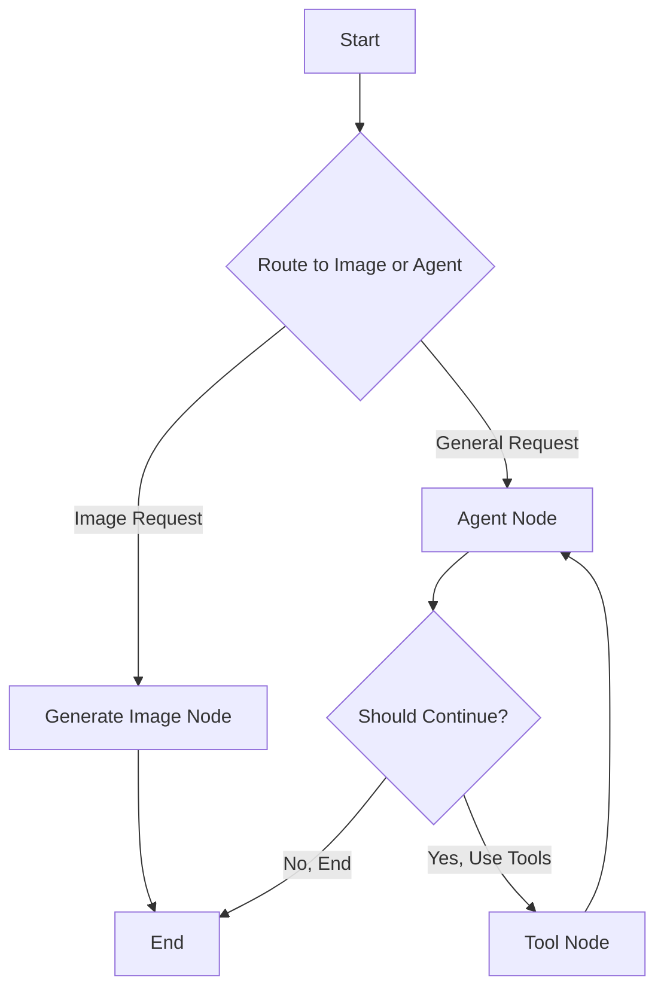
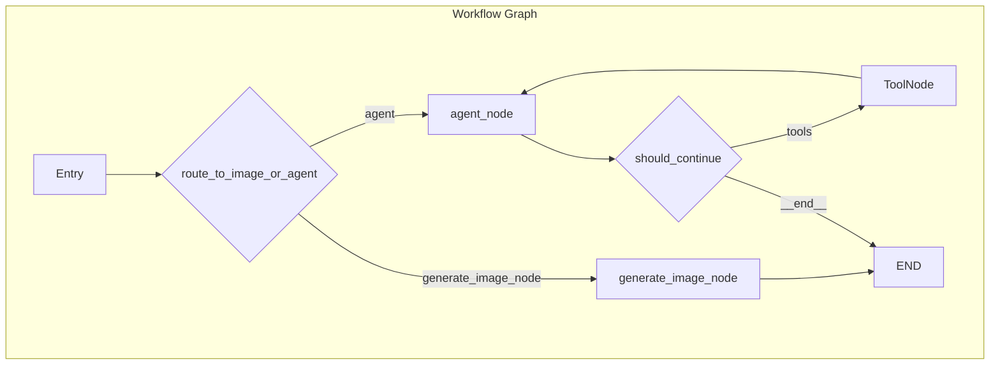

# Text2SQL Discord Bot with Generative AI

This project is a powerful, multi-functional Discord bot that leverages generative AI to interact with a MySQL database, generate images, and process files. It uses the LangGraph library to create a robust, stateful agent that can intelligently route user requests to the appropriate tools.

## Key Features

- **Natural Language to SQL:** Ask questions in plain English, and the bot will query the database to get you the answers.
- **Excel Export:** Easily export the results of any database query to a `.xlsx` file.
- **Image Generation & Modification:** Generate new images from a text prompt or modify existing ones by providing an image and instructions.
- **File Processing:** Upload various file types (`.txt`, `.csv`, `.pdf`, `.xlsx`, `.png`, `.jpg`), and the bot will understand their content.
- **Intelligent Routing:** The bot automatically determines whether a request is for data, image generation, or general chat, and routes it to the correct tool.
- **Extensible Toolset:** Built with a modular tool system that can be easily expanded with new capabilities.

## Project Structure

```
.
├── config.py               # Handles configuration, API keys, and LLM initialization.
├── main.py                 # The main entry point for the Discord bot.
├── requirements.txt        # A list of all the project dependencies.
├── utils.py                # Utility functions for tasks like Excel export and path finding.
├── .env.example            # An example file for environment variables.
│
├── lang/
│   ├── graph/
│   │   └── graph.py        # Defines the agent's workflow and routing logic using LangGraph.
│   ├── node/
│   │   └── node.py         # Contains the core functions (nodes) that the agent executes.
│   ├── state/
│   │   └── state.py        # Defines the data structure (state) that is passed through the graph.
│   └── tools/
│       ├── tools.py        # Defines the individual tools the agent can use (e.g., query_database).
│       └── file_processor.py # Handles the logic for processing uploaded files.
│
└── output/                 # Default directory for generated Excel files and images.```

## Agent Workflow

The bot uses LangGraph to manage a stateful, cyclical workflow. This allows the agent to decide which tool to use, execute it, and then return to the agent to decide the next step.



### LangGraph Flow

This diagram shows the specific implementation of the workflow using LangGraph's nodes and conditional edges.



## Setup and Installation

### Prerequisites

- Python 3.9+
- A MySQL Database
- A Discord Bot Token
- A Google AI API Key

### 1. Clone the Repository

```bash
git clone <repository-url>
cd Text2SQL-Discord-Bot
```

### 2. Install Dependencies

It's recommended to use a virtual environment.

```bash
python -m venv venv
source venv/bin/activate  # On Windows, use `venv\Scripts\activate`
pip install -r requirements.txt
```

### 3. Set Up Environment Variables

Create a `.env` file in the root directory by copying the example file:

```bash
cp .env.example .env
```

Now, open the `.env` file and fill in your credentials:

```
# Discord
DISCORD_TOKEN="YOUR_DISCORD_BOT_TOKEN"

# MySQL Database
DB_HOST="localhost"
DB_USER="your_db_user"
DB_PASSWORD="your_db_password"
DB_NAME="your_db_name"

# Google Gemini LLM
GOOGLE_API_KEY="YOUR_GOOGLE_AI_API_KEY"
GEMINI_MODEL_NAME="gemini-1.5-flash-latest"
```

### 4. Run the Bot

Execute the `main.py` script to start the bot:

```bash
python main.py
```

The bot should now be online and ready for use in your Discord server.

## Usage

Once the bot is running and has been added to your Discord server, you can interact with it in any channel it has access to.

- **Querying Data:**
  > `@YourBot show me all the users from the customers table`

- **Exporting to Excel:**
  > `@YourBot export all orders from 2023 to excel`

- **Generating an Image:**
  > `@YourBot generate an image of a futuristic cityscape`

- **Modifying an Image:**
  > Upload an image and comment: `@YourBot make this picture black and white`

- **File Q&A:**
  > Upload a `.csv` file and ask: `@YourBot what is the summary of this data?`

## Running with Docker

You can also run the bot inside a Docker container for easier deployment and dependency management.

### 1. Build the Docker Image

From the root directory of the project, run the following command:

```bash
docker build -t text2sql-discord-bot .
```

### 2. Run the Docker Container

Make sure your `.env` file is correctly filled out. Then, run the container using the following command:

```bash
docker run --env-file .env text2sql-discord-bot
```

The bot will now be running inside the container and should connect to Discord.
